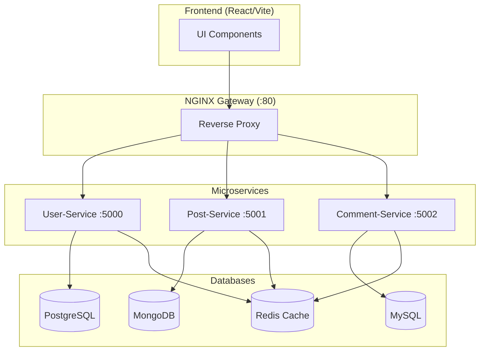
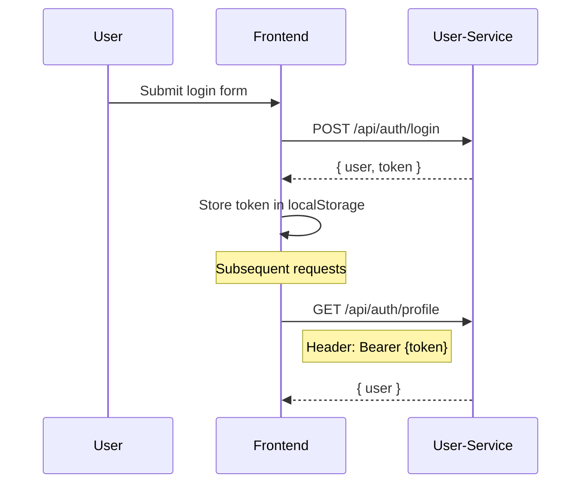

# 📊 Backend Microservices Data Audit

> **Purpose**: Document all backend entities, API endpoints, and authentication requirements without making any schema changes.

---

## Architecture Overview



---

## 1. User Service (Authentication)

| Property | Value |
|----------|-------|
| **Base URL** | `/api/auth` |
| **Database** | PostgreSQL |
| **Port** | 5000 |

### Authorization Structure

> [!IMPORTANT]
> Uses **Bearer Token** authentication via the `Authorization` header.

```
Authorization: Bearer <JWT_TOKEN>
```

**JWT Payload Structure:**
```json
{
  "id": 1,
  "email": "user@example.com",
  "role": "user"
}
```

### User Entity Schema

| Field | Type | Required | Notes |
|-------|------|----------|-------|
| `id` | INTEGER | ✅ | Auto-increment, Primary Key |
| `name` | STRING | ✅ | User's display name |
| `email` | STRING | ✅ | Unique, validated |
| `password` | STRING | ✅ | Bcrypt hashed |
| `role` | STRING | — | Default: 'user' |
| `created_at` | TIMESTAMP | — | Auto-generated |

### API Endpoints

| Method | Endpoint | Auth Required | Response |
|--------|----------|---------------|----------|
| `POST` | `/api/auth/signup` | ❌ | `{ user, token }` |
| `POST` | `/api/auth/login` | ❌ | `{ user, token }` |
| `GET` | `/api/auth/profile` | ✅ Bearer | `{ user }` |
| `GET` | `/api/auth/health` | ❌ | Health check |

### Login Response Example
```json
{
  "message": "Login successful",
  "user": {
    "id": 1,
    "name": "John Doe",
    "email": "john@example.com",
    "role": "user"
  },
  "token": "eyJhbGciOiJIUzI1NiIsInR5cCI6IkpXVCJ9..."
}
```

---

## 2. Post Service

| Property | Value |
|----------|-------|
| **Base URL** | `/api/posts` |
| **Database** | MongoDB |
| **Port** | 5001 |

### Post Entity Schema

| Field | Type | Required | Notes |
|-------|------|----------|-------|
| `_id` | ObjectId | ✅ | MongoDB auto-generated |
| `authorId` | STRING | ✅ | Reference to User.id (stored as string) |
| `title` | STRING | ✅ | Max 200 chars, trimmed |
| `slug` | STRING | ✅ | Unique, lowercase, auto-generated |
| `imageUrl` | STRING | ❌ | Cover image URL, default: '' |
| `excerpt` | STRING | ❌ | Max 500 chars |
| `content` | STRING | ✅ | Full post content |
| `status` | ENUM | — | 'draft' \| 'published' \| 'archived' |
| `publishedAt` | DATE | ❌ | When status changed to published |
| `likesCount` | NUMBER | — | Denormalized, default: 0 |
| `commentsCount` | NUMBER | — | Denormalized, default: 0 |
| `viewsCount` | NUMBER | — | Denormalized, default: 0 |
| `isDeleted` | BOOLEAN | — | Soft delete flag, default: false |
| `createdAt` | DATE | — | Auto-generated by Mongoose |
| `updatedAt` | DATE | — | Auto-generated by Mongoose |

### API Endpoints

| Method | Endpoint | Auth Required | Response |
|--------|----------|---------------|----------|
| `GET` | `/api/posts` | ❌ | `{ posts, cached }` |
| `GET` | `/api/posts/:id` | ❌ | `{ post, cached }` |
| `POST` | `/api/posts` | ✅ Bearer | `{ message, post }` |
| `PUT` | `/api/posts/:id` | ✅ Bearer + Owner | `{ message, post }` |
| `DELETE` | `/api/posts/:id` | ✅ Bearer + Owner | `{ message }` |
| `GET` | `/api/health` | ❌ | Health check |

### Get All Posts Response Example
```json
{
  "posts": [
    {
      "_id": "507f1f77bcf86cd799439011",
      "authorId": "1",
      "title": "Getting Started with React",
      "slug": "getting-started-with-react",
      "imageUrl": "https://example.com/image.jpg",
      "excerpt": "A beginner's guide to React development...",
      "content": "<p>Full post content here...</p>",
      "status": "published",
      "publishedAt": "2024-01-15T10:30:00.000Z",
      "likesCount": 42,
      "commentsCount": 8,
      "viewsCount": 1250,
      "isDeleted": false,
      "createdAt": "2024-01-15T10:00:00.000Z",
      "updatedAt": "2024-01-15T10:30:00.000Z"
    }
  ],
  "cached": false
}
```

---

## 3. Comment Service

| Property | Value |
|----------|-------|
| **Base URL** | `/api/comments` |
| **Database** | MySQL |
| **Port** | 5002 |

### Comment Entity Schema

| Field | Type | Required | Notes |
|-------|------|----------|-------|
| `id` | INT | ✅ | Auto-increment, Primary Key |
| `post_id` | STRING | ✅ | Reference to Post._id |
| `user_id` | INT | ❌ | Reference to User.id (nullable for guests) |
| `content` | TEXT | ✅ | Comment text |
| `parent_comment_id` | INT | ❌ | For nested comments |
| `author_name` | STRING | ❌ | Guest commenter name |
| `status` | STRING | — | 'active' \| 'deleted' |
| `created_at` | TIMESTAMP | — | Auto-generated |

### API Endpoints

| Method | Endpoint | Auth Required | Response |
|--------|----------|---------------|----------|
| `GET` | `/api/comments/post/:postId` | ❌ | `{ data, cached }` |
| `POST` | `/api/comments` | ❌ (guest OK) | `{ success, data }` |
| `PUT` | `/api/comments/:id` | ✅ Bearer + Owner | `{ success, message }` |
| `DELETE` | `/api/comments/:id` | ✅ Bearer + Owner | `{ success, message }` |
| `GET` | `/api/comments/health` | ❌ | Health check |

### Create Comment Request
```json
{
  "postId": "507f1f77bcf86cd799439011",
  "content": "Great article, thanks for sharing!",
  "parentCommentId": null,
  "authorName": "Anonymous Reader"
}
```

---

## 4. Infrastructure Services

### Redis Cache
- **Purpose**: Caching & Rate Limiting
- **Port**: 6379
- **Cache Keys**:
  - `posts:all` — All posts list (TTL: 120s)
  - `post:{id}` — Single post (TTL: 120s)
  - `comments:post:{postId}` — Comments for post (TTL: 120s)

### RabbitMQ Message Broker
- **Port**: 5672 (AMQP), 15672 (Management UI)
- **Queues**:
  - `user_created` — Published on signup
  - `user_logged_in` — Published on login
  - `post_created` — Published on post creation

---

## 5. Frontend API Configuration

**Current axios configuration** (`frontend/src/api/axios.config.js`):
- Base URL: `http://localhost` (via NGINX gateway)
- Token storage: `localStorage.getItem('authToken')`
- Auto-logout on 401 response

### Service URL Mapping (via NGINX)

| Frontend Path | Backend Service |
|---------------|-----------------|
| `/api/auth/*` | `user-service:5000` |
| `/api/posts/*` | `post-service:5001` |
| `/api/comments/*` | `comment-service:5002` |

---

## 6. Key Observations for Frontend

> [!NOTE]
> **Data Gaps** that exist between W&D design needs and current backend:

| Feature | Required By | Status |
|---------|-------------|--------|
| Categories | W&D Category Filter | ❌ **NOT IN SCHEMA** |
| Author Name/Avatar | W&D Author Display | ⚠️ Requires join with User-Service |
| Estimated Read Time | W&D Article Cards | ❌ **NOT IN SCHEMA** |
| Featured Flag | W&D Hero Section | ❌ **NOT IN SCHEMA** |
| Tags | W&D Tag Cloud | ❌ **NOT IN SCHEMA** |

> [!IMPORTANT]
> **Frontend Workarounds** (No backend changes allowed):
> 1. **Read Time**: Calculate on frontend using `content.length / 200` (words per minute)
> 2. **Categories**: Use static categories or extract from title/content keywords
> 3. **Author Info**: Display `User #${authorId}` or fetch separately via `/api/auth/profile`
> 4. **Featured Post**: Use first published post or most recent

---

## 7. Authentication Flow Summary



---

*Document generated for Microservices Blog Platform editorial redesign*
